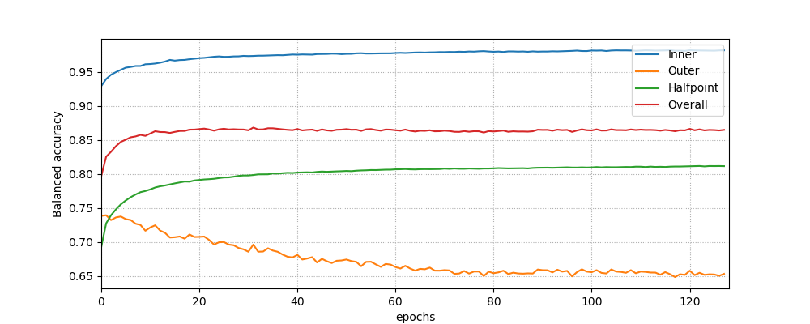

# torchosr

The ``torchosr`` module is a set of tools for Open Set Recognition in Python, compatible with PyTorch library.

Package documentation can be accessed through [readthedocs](https://torchosr.readthedocs.io)

## Citation policy

If you use `torchosr` in a scientific publication, we would appreciate citation to the following article:

```
@misc{komorniczak2023torchosr,
      title={torchosr -- a PyTorch extension package for Open Set Recognition models evaluation in Python}, 
      author={Joanna Komorniczak and Pawel Ksieniewicz},
      year={2023},
      eprint={2305.09646},
      archivePrefix={arXiv},
      primaryClass={cs.LG}
}
```
## Quick start guide

### Installation
To use the `torchosr` package, it will be absolutely useful to install it. Fortunately, it is available in the *PyPI* repository, so you may install it using `pip`:

```shell
pip install torchosr
```

In case of necessity to expand it with functions that it does not yet include, it is also possible to install the module directly from the source code. If any modifications are introduced, they propagate to the module currently available to the environment.

```shell
git clone https://github.com/w4k2/torchosr.git
cd torchosr
make install
```

### Minimal processing example

The `torchosr` package can be imported in the standard Python manner.

```python
# Importing torchosr
import torchosr
```
The code below allows loading the `MNIST_base` dataset.

```python
# Import transforms for pre-processing
from torchvision import transforms

# Load MNIST dataset
data = torchosr.data.base_datasets.MNIST_base(root = 'data', download = True, transform = transforms.Compose([transforms.Resize(28),transforms.ToTensor()]))

```
```
> Dataset MNIST_base
> Number of datapoints: 70000
> Root location: data
```

Then, for the loaded file, the `configure_division` function will generate configurations for derived OSR datasets. The sample code generates nine configurations - three class assignments for three `Openness` each.

```python
# Generate OSR problem configurations
config, openness = torchosr.data.configure_division(data, n_openness = 3, repeats = 3, seed = 1234)
# Print configurations
for i, (kkc, uuc) in enumerate(config):
    print('C%i - Op: %.3f KKC:%s \t UUC:%s' % (
        i, 
        openness[int(i/3)].detach().numpy(), 
        kkc.detach().numpy(), 
        uuc.detach().numpy()))
```
```
> C0 - Op: 0.047 KKC:[0 1 7 9 3] 	 UUC:[6]
> C1 - Op: 0.047 KKC:[6 4 9 2 7] 	 UUC:[1]
> C2 - Op: 0.047 KKC:[1 6 7 0 5] 	 UUC:[9]
> C3 - Op: 0.225 KKC:[8 4 5] 	     UUC:[3 1 9 6]
> C4 - Op: 0.225 KKC:[9 7 4] 	     UUC:[2 5 0 8]
> C5 - Op: 0.225 KKC:[0 4 2] 	     UUC:[3 9 6 8]
> C6 - Op: 0.397 KKC:[3 6] 	         UUC:[9 1 4 0 8 7 5]
> C7 - Op: 0.397 KKC:[2 5] 	         UUC:[9 8 6 3 1 4 7]
> C8 - Op: 0.397 KKC:[4 1] 	         UUC:[3 0 5 9 2 7 8]
```

The next step is determining the actual training and test set for the evaluation. The `get_train_test` method will be used for this from data modules. In the example code, the division was made for the first of the nine generated configurations and the first of the five folds.

```python
# Import DataLoader
from torch.utils.data import DataLoader

# Select KKC and UUC from configuration
kkc, uuc = config[0]

# Get training and testing data for first out of 5 folds
train_data, test_data = torchosr.data.get_train_test(data, kkc, uuc, root = 'data', tunning = False, fold = 0, n_folds = 5, seed = 1234)

# Create DataLoaders
train_data_loader = DataLoader(train_data, batch_size=64, shuffle=True)
test_data_loader = DataLoader(test_data, batch_size=64, shuffle=True)
```

For the purpose of presentation, labels of objects located in the training and test data loaders were displayed. By default, labels are transformed using the one-hot encoder. In the test subset, the last label represents objects of an unknown class. The classes have been re-indexed in both subsets so that their labels are consecutive integers.

```python
import numpy as np

# Load first batch of Train data and print unique labels
X, y = next(iter(train_data_loader))
print('Train labels:', np.unique(np.argmax(y, axis=1)))

# Load first batch of Test data and print unique labels
X, y = next(iter(test_data_loader))
print('Test labels:', np.unique(np.argmax(y, axis=1)))
```

```
> Train labels: [0 1 2 3 4]
> Test labels: [0 1 2 3 4 5]
```

The method of initializing the `TSoftmax` method is presented below. The simplest architecture available in the package (consisting only of fully connected layers) was used. The `depth` and `img_size_x` parameters describe the dimensions of the images in the MNIST set. The epsilon parameter was determined using a method available in the `Utils` module, which returns a suboptimal parameter value for a given KKC cardinality.

```python
# Initialize lower stack
ls = torchosr.architectures.fc_lower_stack(depth=1, img_size_x=28, n_out_channels=64)

# Get epsilon parameter for given number of KKC
epsilon = torchosr.utils.base.get_softmax_epsilon(len(kkc))

# Initialize method
method = torchosr.models.TSoftmax(lower_stack=ls, n_known=len(kkc), epsilon=epsilon)
```

It is possible to further proceed with evaluation of the model for the given data. In the example, the number of epochs and the learning rate were defined, a table for the results from subsequent epochs was created, and the loss function and optimizer were defined. In a loop, for each epoch, the training and testing procedure was carried out. The values returned by the test method (Inner, Outer, Halfpoint and Overall scores, respectively) were saved to the table.

```python
import torch

# Specify processing parameters
epochs = 128
learning_rate = 1e-3

# Prepare array for results
results = torch.zeros((4,epochs))

# Initialize loss function
loss_fn = torch.nn.CrossEntropyLoss()

# Initialize optimizer
optimizer = torch.optim.SGD(method.parameters(), lr=learning_rate)

for t in range(epochs):
    # Train
    method.train(train_data_loader, loss_fn, optimizer)
    
    # Test
    inner_score, outer_score, hp_score, overall_score = method.test(test_data_loader, loss_fn)
    results[:, t] = torch.tensor([inner_score, outer_score, hp_score, overall_score])     
```

The results of the single processing can be visualized using `matplotlib` library. The output of code presented below is shown in Figure.

```python
import matplotlib.pyplot as plt

# Present results
fig, ax = plt.subplots(1,1,figsize=(10,4))
ax.plot(results.T, label=['Inner', 'Outer', 'Halfpoint', 'Overall'])
ax.legend()
ax.grid(ls=':')
ax.set_xlabel('epochs')
ax.set_ylabel('Balanced accurracy')
ax.set_xlim(0,epochs)
```



During the test procedure, one can also request a confusion matrix by using the `conf` flag in the test routine.

```python
# Call of test method with conf flag
inner_score, outer_score, hp_score, overall_score, \
    inner_c, outer_c, hp_c, overall_c = method.test(test_data_loader, loss_fn, conf=True)

# Print overall confusion matrix
print(overall_c.detach().numpy())

```
```
>  [[1244,    2,    1,    1,    3,   12],
    [   1, 1406,    6,    2,    1,   12],
    [   1,    2, 1240,    6,    3,   25],
    [   0,    5,    5, 1303,    7,   25],
    [   5,    4,   18,    7, 1206,   22],
    [ 367,  111,   76,   14,  250,  411]]
```


